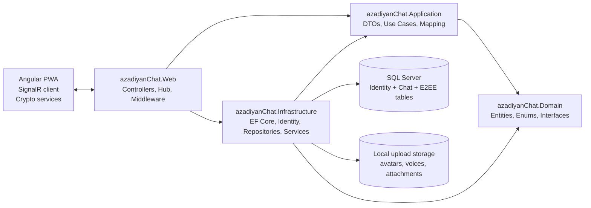
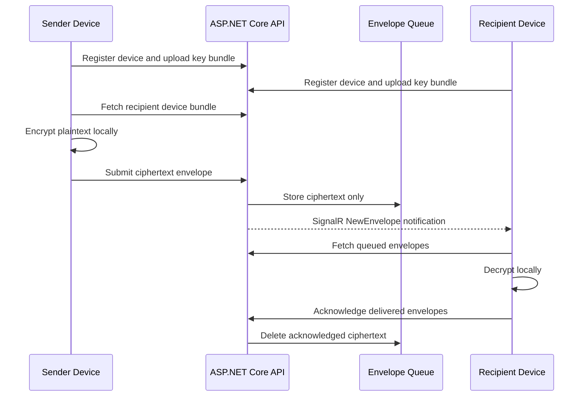

<div align="center">
  

  <h1>azadiyanChat</h1>

  <p>
    A secure, real-time messaging platform built with
    ASP.NET Core, Angular, SignalR, EF Core, and client-side cryptography.
  </p>

  <p>
    
    
    
    
    
  </p>
</div>

---

## Overview

azadiyanChat is a full-stack messaging application that combines a polished messenger-style user experience with a layered .NET backend and a modern Angular PWA frontend.

The project supports private chats, group conversations, saved messages, voice notes, file attachments, reactions, message forwarding, typing indicators, online presence, profile management, and multi-device encrypted messaging flows.

It has two distinct message security paths:

| Path | Server sees plaintext? | Database protection | End-to-end encrypted? |
|---|---:|---:|---:|
| Normal chat API, `/api/chats/...` | Yes | AES-GCM encrypted message chunks | No |
| Envelope API, `/api/envelopes` | No | Server stores ciphertext only | Yes |

This distinction is intentional: the normal chat path offers practical at-rest protection for server-managed chat features, while the envelope path is designed for device-to-device encrypted payloads.

---

## Highlights

| Area | What is included |
|---|---|
| Messaging | Direct chats, groups, saved messages, replies, editing, deletion, forwarding, reactions, unread counts |
| Real time | SignalR chat groups, typing indicators, delivery/seen status, online/offline presence, key-change notifications |
| Security | Cookie auth hardening, rate limiting, security headers, membership checks, upload validation |
| At-rest encryption | Message text stored as encrypted chunks with per-chat, per-message, and per-chunk key derivation |
| E2EE flow | Device registration, identity keys, signed pre-keys, one-time pre-keys, Kyber pre-key records, envelope queueing |
| Attachments | Classic upload endpoints plus encrypted attachment chunk upload/download for E2EE payloads |
| Frontend | Angular standalone components, zoneless change detection, PWA service worker, dark/light themes, GSAP interactions |
| Testing | xUnit integration tests for auth, devices, key bundles, envelopes, groups, unread counts, voice messages, and encryption |
| Performance | EF Core indexes, split queries, no-tracking reads, batched envelope deduplication, cached SignalR hot paths |

---

## Product Surface

azadiyanChat is built as a usable messaging client, not only as an API demo.

| Screen / Flow | Capabilities |
|---|---|
| Auth | Register, login, logout, authenticated session restoration |
| Chat list | Search, pinned chats, unread badges, profile card, theme toggle, update/release modal |
| Chat room | Message bubbles, grouped messages, reply swipe, edit/delete, reactions, forward modal |
| Media | Image/video/audio/document attachments, drag-and-drop, upload progress, voice recorder, waveform player |
| Groups | Create group, view members, add/remove members with role-aware management |
| Saved messages | Local vault-style saved message encryption flow |
| PWA | Installable app shell, service worker registration, release manifest support |

---

## Architecture

The backend follows a clean, layered shape:



### Projects

```text
src/
  azadiyanChat.Domain/           Entities, enums, repository contracts
  azadiyanChat.Application/      DTOs, app services, mapping, service interfaces
  azadiyanChat.Infrastructure/   EF Core, Identity, repositories, encryption/storage services
  azadiyanChat.Web/              ASP.NET Core API, SignalR hub, middleware, SPA hosting
    ClientApp/                    Angular 21 PWA client
tests/
  azadiyanChat.IntegrationTests/ End-to-end API and security-flow integration tests
```

---

## Security Model

### Normal Chat Message Storage

Messages sent through `/api/chats/{chatId}/messages` are handled by the server so they can support server-side chat history, replies, reactions, edits, deletes, unread counts, and broadcasts.

Before text is persisted, it is split into chunks and encrypted:

```text
masterKey
  -> chatKey(chatId)
    -> messageKey(messageId)
      -> chunkKey(chunkIndex)
```

Each chunk payload uses this layout:

```text
[1-byte version][12-byte nonce][16-byte tag][ciphertext...]
```

Current encrypted message chunk version: `v2`

Authenticated associated data includes:

```text
chatId || messageId || chunkIndex
```

That means a chunk cannot be moved between chats, messages, or indexes without failing authentication during decrypt.

### Device-to-Device E2EE

The E2EE route is based around device registration, key bundles, and ciphertext envelopes:



The server validates, deduplicates, queues, expires, and notifies. It does not decrypt envelope content.

### Encrypted Attachments

E2EE attachments and voice notes are encrypted on the client and uploaded as chunks. The server stores encrypted blob data and metadata; the decryption pointer is transported inside an encrypted envelope.

---

## Technology Stack

### Backend

| Technology | Purpose |
|---|---|
| .NET 10 / ASP.NET Core | Web API, middleware, SignalR hub, SPA hosting |
| Entity Framework Core 10 | SQL Server persistence and migrations |
| ASP.NET Core Identity | Cookie-based authentication and user accounts |
| SignalR | Real-time chat events, presence, typing, status updates |
| xUnit | Integration test coverage |

### Frontend

| Technology | Purpose |
|---|---|
| Angular 21 | Standalone PWA client |
| RxJS | Async streams and API state |
| Angular service worker | Installable PWA and update flow |
| `@microsoft/signalr` | Realtime client transport |
| `@privacyresearch/libsignal-protocol-typescript` | Signal Protocol client cryptography |
| `libsodium-wrappers-sumo` | Encrypted attachment and voice blob primitives |
| `argon2-browser` | Local key derivation for client-side protected storage |
| GSAP / Lottie | Interface animation and interaction polish |
| Phosphor Icons | Icon system |

---

## API Map

| Area | Endpoints |
|---|---|
| Auth | `POST /api/auth/register`, `POST /api/auth/login`, `POST /api/auth/logout`, `GET /api/auth/me` |
| Users | `GET /api/users/search`, `GET /api/users/{id}`, `PUT /api/users/profile` |
| Chats | `GET /api/chats`, `GET /api/chats/saved`, `GET /api/chats/{id}`, `POST /api/chats`, `PUT /api/chats/{id}/pin`, `POST /api/chats/{id}/read` |
| Members | `GET /api/chats/{id}/members`, `POST /api/chats/{id}/members`, `DELETE /api/chats/{id}/members/{memberUserId}` |
| Messages | `GET /api/chats/{chatId}/messages`, `POST /api/chats/{chatId}/messages`, `PUT /api/chats/{chatId}/messages/{id}`, `DELETE /api/chats/{chatId}/messages/{id}` |
| Reactions / Forwarding | `POST /api/chats/{chatId}/messages/{id}/reactions`, `DELETE /api/chats/{chatId}/messages/{id}/reactions/{emoji}`, `POST /api/chats/{chatId}/messages/{id}/forward` |
| Files | `POST /api/files/voice`, `POST /api/files/avatar`, `POST /api/files/attachment` |
| Devices | `POST /api/devices/register`, `GET /api/devices`, `DELETE /api/devices/{deviceId}` |
| Key Bundles | `POST /api/keys/bundle/{deviceId}`, `GET /api/keys/bundle/{userId}`, `GET /api/keys/bundle/{userId}/{deviceId}`, `POST /api/keys/replenish/{deviceId}`, `GET /api/keys/otpk-count/{deviceId}` |
| Envelopes | `POST /api/envelopes`, `GET /api/envelopes/{deviceId}`, `POST /api/envelopes/ack/{deviceId}` |
| Encrypted Attachments | `POST /api/attachments/upload`, `PUT /api/attachments/{attachmentId}/chunks/{chunkIndex}`, `POST /api/attachments/{attachmentId}/complete`, `GET /api/attachments/{attachmentId}` |
| Realtime | SignalR hub at `/chatHub` |

---

## Getting Started

### Prerequisites

- .NET SDK 10
- Node.js 22 or newer
- SQL Server or LocalDB
- Git

### 1. Clone and restore

```bash
git clone <your-repository-url>
cd chat
dotnet restore azadiyanChat.slnx
```

### 2. Configure the database

The default connection string lives in:

```text
src/azadiyanChat.Web/appsettings.json
```

Update it for your SQL Server or LocalDB instance if needed:

```json
{
  "ConnectionStrings": {
    "DefaultConnection": "Server=(localdb)\\mssqllocaldb;Database=azadiyanChatDb;Trusted_Connection=True;MultipleActiveResultSets=true;TrustServerCertificate=True"
  }
}
```

The app runs EF Core migrations at startup through `SeedData.InitializeAsync(...)`.

### 3. Set the message protection key

For development, the project can derive a fallback key when no key is configured. For production, configure a Base64-encoded 32-byte key.

Generate one with PowerShell:

```powershell
$bytes = New-Object byte[] 32
[System.Security.Cryptography.RandomNumberGenerator]::Fill($bytes)
[Convert]::ToBase64String($bytes)
```

Then set:

```json
{
  "MessageTextProtection": {
    "MasterKey": "BASE64_32_BYTE_KEY",
    "ChunkSizeBytes": 512
  }
}
```

Do not commit production keys.

### 4. Run the backend

```bash
dotnet run --project src/azadiyanChat.Web --launch-profile https
```

The checked-in launch profile uses:

```text
https://localhost:7228
http://localhost:5045
```

### 5. Run the Angular client

```bash
cd src/azadiyanChat.Web/ClientApp
npm install
npm run start
```

Angular runs on:

```text
http://localhost:4200
```

Development proxy note: `ClientApp/proxy.conf.json` currently targets `https://localhost:5001`. If your backend is running on `https://localhost:7228`, update the proxy target or run the API on `https://localhost:5001`.

### Demo Account

When the database is empty, the seed step creates a demo identity user:

```text
Email:    demo@telegram.com
Password: Demo@123
```

---

## Testing

Run the integration test suite:

```bash
dotnet test tests/azadiyanChat.IntegrationTests/azadiyanChat.IntegrationTests.csproj
```

Covered flows include:

- Auth logout behavior
- Device registration and ownership checks
- Key bundle and one-time pre-key consumption
- Envelope deduplication
- Group chat and member management
- Message at-rest encryption
- Voice message flow
- Unread count behavior
- API contract snapshots

---

## Performance Notes

The repository includes a dedicated performance report in [`PERF_REPORT.md`](PERF_REPORT.md). Current backend and frontend optimizations include:

| Optimization | Impact |
|---|---|
| Batched envelope deduplication | Reduces per-envelope database round-trips |
| EF Core `AsSplitQuery()` | Avoids large cartesian joins on chat/message reads |
| `AsNoTracking()` read paths | Reduces read-side allocation and tracking overhead |
| Targeted indexes | Speeds up chat participant, message history, unread count, and envelope queue queries |
| SignalR connection cache | Avoids repeated database lookups on hot paths such as typing |
| Frontend computed-signal caching | Reduces repeated derived state allocations |

---

## Configuration Reference

| Setting | Location | Purpose |
|---|---|---|
| `ConnectionStrings:DefaultConnection` | `src/azadiyanChat.Web/appsettings.json` | SQL Server connection |
| `MessageTextProtection:MasterKey` | `src/azadiyanChat.Web/appsettings.json` or environment config | 32-byte Base64 key for at-rest message text encryption |
| `MessageTextProtection:ChunkSizeBytes` | `src/azadiyanChat.Web/appsettings.json` | Plaintext chunk size before AES-GCM encryption |
| Angular proxy target | `src/azadiyanChat.Web/ClientApp/proxy.conf.json` | API, SignalR, and upload proxy for local frontend development |
| Release manifest | `src/azadiyanChat.Web/ClientApp/public/release-manifest.json` | PWA release notes and update prompt metadata |

---

## Repository Structure

```text
.
|-- PERF_REPORT.md
|-- README.md
|-- azadiyanChat.slnx
|-- src
|   |-- azadiyanChat.Domain
|   |-- azadiyanChat.Application
|   |-- azadiyanChat.Infrastructure
|   `-- azadiyanChat.Web
|       |-- Controllers/Api
|       |-- Hubs
|       |-- Services
|       |-- wwwroot
|       `-- ClientApp
`-- tests
    `-- azadiyanChat.IntegrationTests
```

---

## Important Security Notes

- The normal chat endpoint protects message text at rest, but it is not end-to-end encrypted because the server receives plaintext.
- The envelope endpoint is the E2EE-oriented path: the server stores and routes ciphertext only.
- Production deployments must use a strong `MessageTextProtection:MasterKey` from a secret manager or environment-specific configuration.
- Cookie settings are hardened with `HttpOnly`, `Secure`, strict SameSite behavior, and API-friendly 401/403 responses.
- Rate limits are applied to auth, envelopes, keys, and uploads.
- Security headers include CSP, frame denial, content-type sniffing protection, referrer policy, permissions policy, and no-store headers for API responses.

---

## Roadmap Ideas

- Add CI workflow for build, Angular build, and integration tests
- Add Docker Compose for SQL Server plus app startup
- Add production deployment guide
- Add screenshot gallery once final UI screenshots are captured
- Add QR-based device linking and safety-number verification UX
- Add attachment forwarding for attachment-only messages

---

## License

No license file is currently included. Add a license before publishing this repository publicly.

